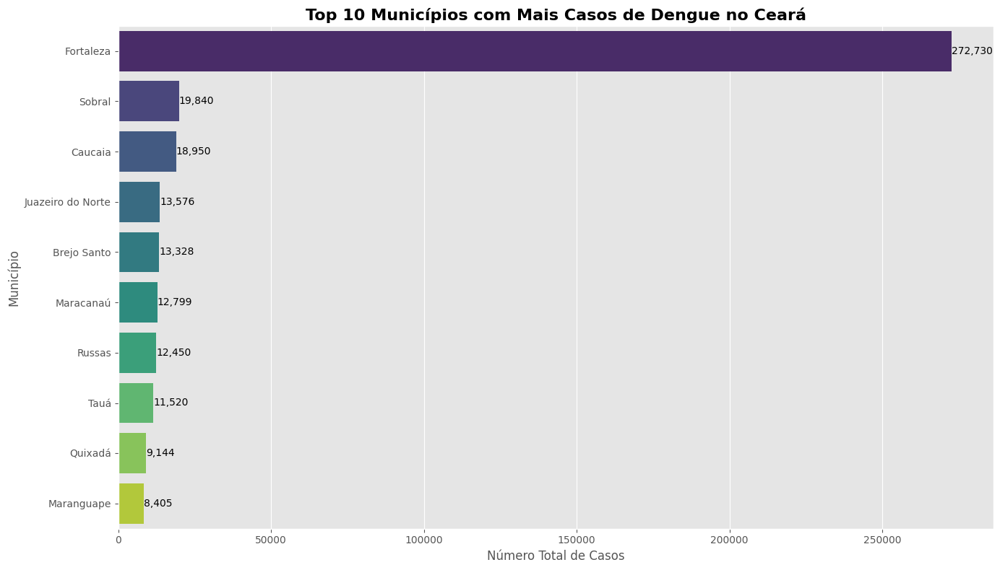
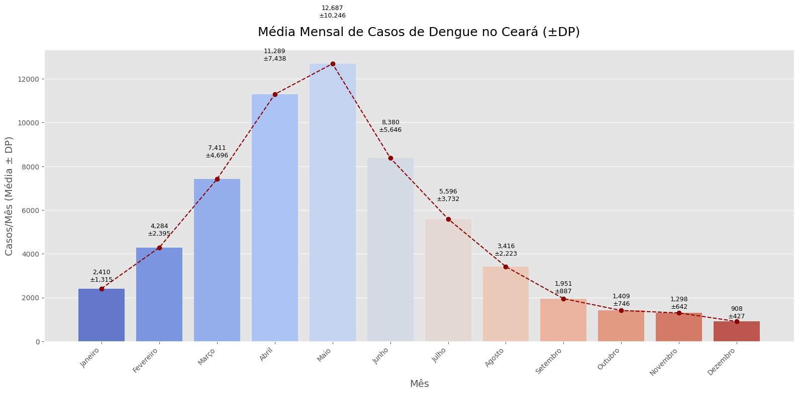
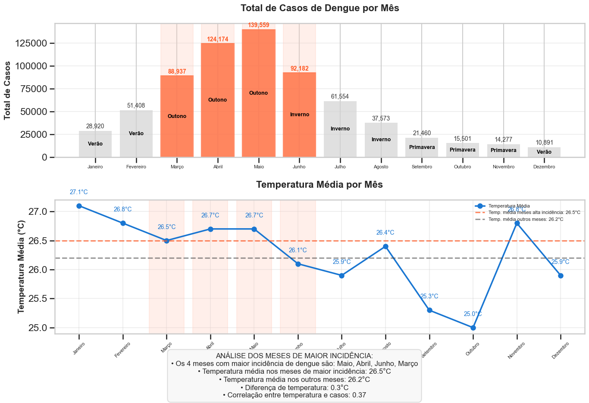
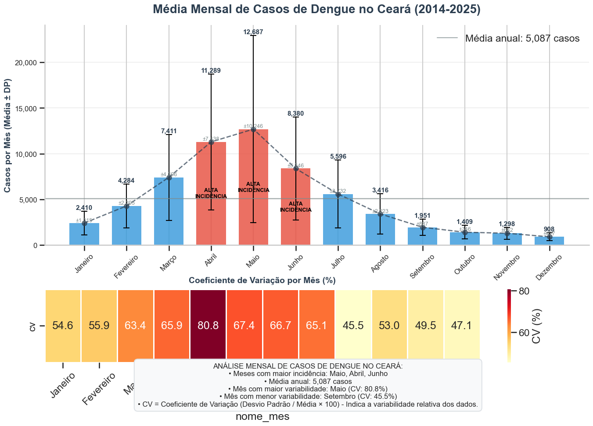
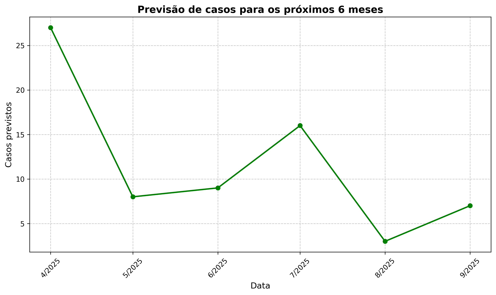

# Análise de Dengue no Ceará

Este projeto realiza uma análise preditiva dos casos de dengue no estado do Ceará, utilizando técnicas de análise de dados e machine learning.

## 📊 Resultados da Análise

### Análise Inicial

### Tendência dos Casos

### Distribuição Geográfica

### Análise Temporal dos Casos

### Teste do Modelo KNN

### Previsão para os próximos 6 meses

## 📁 Estrutura do Projeto

- `mai.ipynb`: Notebook principal com a análise completa
- `novo.py`: Script Python com funções auxiliares
- `modelo_regressao_dengue.py`: Implementação do modelo de regressão
- `dengue_ce_tratado.csv`: Dataset tratado para análise
- `dengue_ce_municipios_2014_2025.csv`: Dataset completo com dados históricos

## 🛠️ Tecnologias Utilizadas

- Python
- Pandas
- Scikit-learn
- Matplotlib
- Seaborn

## 📈 Principais Funcionalidades

1. Análise temporal dos casos de dengue
2. Previsão de casos futuros
3. Análise geográfica da distribuição dos casos
4. Modelagem preditiva usando regressão
5. Visualização de tendências e padrões

## 🔍 Como Usar

1. Clone o repositório
2. Instale as dependências necessárias
3. Execute o notebook `mai.ipynb` para ver a análise completa
4. Para executar apenas o modelo de previsão, use `modelo_regressao_dengue.py`

## 📝 Notas

- Os dados utilizados são do período de 2014 a 2025
- O modelo foi treinado com dados históricos e validado com métricas de performance
- As previsões são atualizadas mensalmente

## 📊 Resultados

O projeto apresenta uma análise detalhada dos casos de dengue no Ceará, incluindo:
- Tendências temporais
- Distribuição geográfica
- Previsões futuras
- Padrões sazonais
- Correlações com fatores ambientais 
